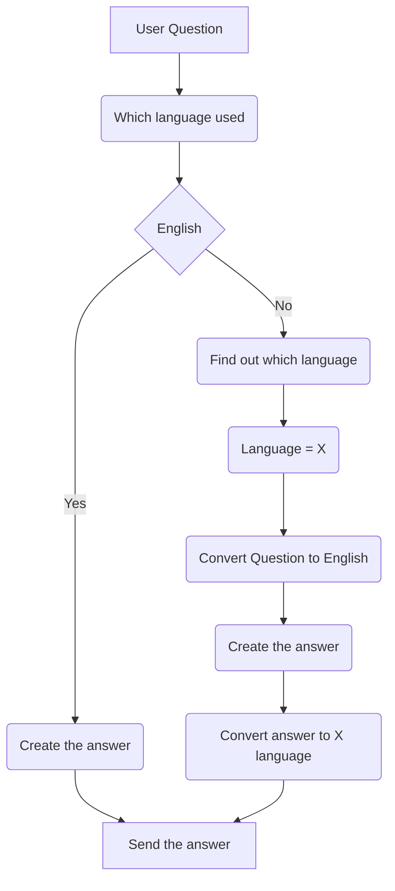

Tasks: Create a RAG to enrich the prompt as meaningful as possible

Problem: Create a chatbot.
Breakdown of Problem:
1. I know the preference of the user.
2. I know the tone to use with the user.
3. I know multiple language, so language is no barrier.
4. I know the answer to the questions from multiple types of data (Memory).
5. I can look up in my memory and give relevant information.
6. I don't say redundant staff.
7. I keep my reply short like text message.
8. If I don't know the answer, I say `I don't know`.
*Extra*:
9. If I don't know the answer I may look into the internet and try to find it.
10. If asked my name and similar questions, I don't say I am Large language model!
11. [Edge Cases] Stability, Performance, Price of the solution.

#### Let's tackle them one by one. ☝️ 
1. **Selecting the preference:** There are many steps to this. It involves these:
		a. Taking the user name
		b. Taking the user age
		c. Inquiring the user preference
			i. Child
			ii. Adult
			iii. Expert
> [!info] These information will go into system prompt.

2. **Selecting the length and details of the message:** There are 3 types of length and details as well.
		i. **Scholar:** Knowledge is the key. This visitor would like to receive all information about the exhibition. Provide a very detailed and thorough
		ii. **Wanderer:** This visitor travels quickly and wants to receive concise information without spending too much time in the museum. Provide a brief, to-the-point response.
		iii. **Muser:** Driven by endless curiosity, this visitor wants to get a deeper insight into the artefacts. Provide a detailed response with some interesting insights, but not as extensive as for a scholar. 

> [!question] We have to maintain the length of the message as well as make sure the vibe of texting doesn't wash away.
> > [!example] May be we can suggest the next message or [Tell me More!] on the UI. That way, user may always be on control of the length and interest level.

3. **Translation and still retaining the context:**


4. **Memory:** I need to identify the given data. And put it into clean format. And convert these data to vector format. Why vector data? Faster computation.
> [!warning] Process a handful of data.

5. **Query Data:** Search in the most relevant data source for the answer
6. **Filtering the response**: Should be achieved with the system prompt. But How do we minimise the token length and still do a great great work in filtering?
7. **Summarise the message**: Perhaps an Agent could handle it.
8. **Truthfulness:** The AI is truthful. If it doesn't know the answer, it truthfully says that it doesn't know.
9. **Dump the conversation:**

The process of working on the case study:

```mermaid  
flowchart TD

%% A[Start] -->|Extract the requirements| B(Breakdown of Task in Chunk)

%% B --> C[Chunk 1. Get the user preference]

%% %% B --> C{Let me think}

%% C -->|One| D[Laptop]

%% C -->|Two| E[iPhone]

%% C -->|Three| F[fa:fa-car Car]

 A[Start] -->|Extract the requirements| B(Breakdown of Task in Chunk)

 B --> C[Chunk 1. Get the user preference]

 C --> C1(Age?)

 C --> C2(Details interest level?)
 
 C --> C3(Preference level?)

 C1 --> CX(Preference collected)
 C2 --> CX
 C3 --> CX


 CX --> D[Chunk 2. Age filteration]
 D --> E[Chunk 3. Query by Multiple language but response in English]
 E --> F[Chunk 4. Chat Memory]
 F --> G[Chunk 5. Vector Store]
 G --> G1[Size and cost]
 G --> G2[Semantic retrieval]
 G --> G3[Scaling]
 G --> G4[Chunking: Example?]
 G1 --> GX[Converted to Vector Store]
 G2 --> GX
 G3 --> GX
 G4 --> GX
 ```
 
 

 Object1 -> faq 
 age -> child/muser/scholar/ -> preference.... -> QR code -> Object identified -> 

How should 
1. N number of conversation --> FAQ 
2. generated from LLM
> [!info] Future Scope: LLM Generated question and answer

CAG [ https://paradigma-digital.medium.com/cag-vs-rag-cache-as-the-new-ally-for-generative-ai-1624e582586]

1. Sensitive Question How to figure out! (Use another agent) /System prompt does a good job/
2. Don't translate noun, terminology Handle (Use another agent) 
3. Create a Pipeline for the data processing (Future Scope)
4. Where to store and what (Read the policy)
5. Can we store the chat? With consent?
